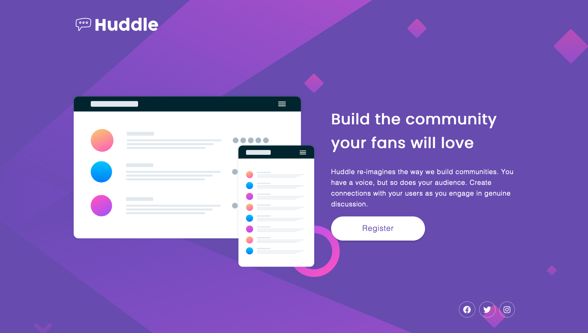

# Huddle landing page with single introductory section solution

## Table of contents

- [Overview](#overview)
  - [The challenge](#the-challenge)
  - [Screenshot](#screenshot)
  - [Links](#links)
- [My process](#my-process)
  - [Built with](#built-with)
  - [What I learned](#what-i-learned)
  - [Continued development](#continued-development)
  - [Useful resources](#useful-resources)
- [Author](#author)
- [Acknowledgments](#acknowledgments)

## Overview

### The challenge

Users should be able to:

- View the optimal layout for the page depending on their device's screen size
- See hover states for all interactive elements on the page

### Screenshot



### Links

- Live Site URL: [live site here](https://awesome-keller-f194fb.netlify.app/)

## My process

I always start by structuring the HTML and placing the content. Then I move to CSS. I start here by setting global styles and my variables. I work with the mobile-first approach. Once mobile is looking great I find my breakpoints and work from there to add flex-box.

### Built with

- Semantic HTML5 markup
- CSS custom properties
- Flexbox
- Mobile-first workflow

### What I learned

I'm still new to CSS so my findings are pretty simple. Reusable classes like a 'container' class can help keep all the content within the same width/gutter size. Mobile-first is new to me as well, and it makes MUCH more sense! I'm still getting flex-box down so I haven't dived too deep into Grid but plan to soon. This project was relatively easy for me! I don't think I nailed it 100% pixel-perfect. But it's pretty close.

```css
.container {
  width: 90%;
  max-width: 1200px;
  margin: 0 auto;
}

@media (min-width: 900px) {
  body {
    background-image: url("/images/bg-desktop.svg");
    background-size: cover;
    text-align: left;
  }

  .hero {
    display: flex;
    align-items: center;
    height: 70vh;
  }

  header {
    height: 20vh;
  }

  .row {
    display: flex;
    justify-content: space-between;
    align-items: center;
    gap: 40px;
  }

  .hero__text {
    max-width: 500px;
    align-self: flex-start;
  }

  h1 {
    font-size: 2rem;
  }

  .icons {
    display: flex;
    justify-content: flex-end;
  }

  .fab {
    font-size: 1.313rem;
  }
}
```

### Continued development

I want to keep focusing on flex-box. I know this layout was simple and there's much more to learn. Building navigation bars is my next step! I've done it before but I just coded along with a tutorial. If you read this far, thanks. :)

### Useful resources

- [Kevin Powell](https://courses.kevinpowell.co/conquering-responsive-layouts) - This helped me get a strong grasp on flex-box and basic responsive layout fundamentals. Kevin Powell is a wizard! 🪄

## Author

- Frontend Mentor - [@afewfirstnames](https://www.frontendmentor.io/profile/afewfirstnames)
